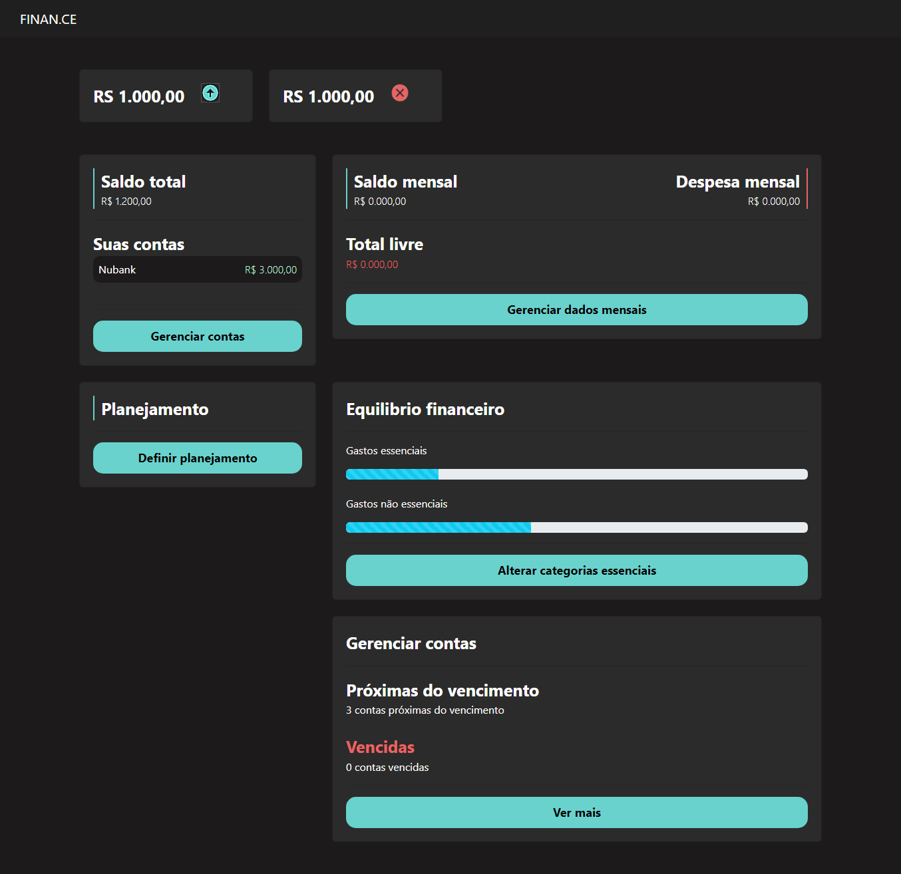

<h1 align="center"> Pythonando | PSW 7.0 </h1>

  
  

Desafio proposto no Evento Pythonando, para ensino de tecnologias WEB.

  

 

<!-- <h3 align="center">✅ Concluído ✅</h3> -->

 <a href="#-Projeto">Sobre o projeto</a> •
 <a href="#-tecnologias">Tecnologias</a> • 
 <a href="#-layout">Layout</a> • 
 <a href="#-Rotas-principais-da-aplicação">Rotas</a> •
<a href="#-Deploy-do-projeto">Deploy</a> •  
 <a href="#Licença">Licença</a>

## 🚀 Tecnologias

Esse projeto foi desenvolvido com as seguintes tecnologias:

  <!--  -->
  
  
  
  
  
  

## 💻 Projeto

o Projeto é uma aplicação de finanças pessoais.
[Mais detalhes do projeto aqui.](https://grizzly-amaranthus-f6a.notion.site/PSW-7-0-a3282ff391074120b3daee721aa65f8f)

## 🔖 Layout

Você pode visualizar o layout do projeto através [DESSE LINK](https://www.figma.com/file/9GhGdXv0fQyrT5ONvJoTGo/psw-7.0?type=design&node-id=0%3A1&mode=design&t=D92r5VeitR982Oc0-1). É necessário ter conta no [Figma](https://figma.com) para acessá-lo.

###  Resultado Aplicação 

 
 

#### Correções e melhorias necessárias

- [ ] Conectar os Gastos por categoria no Dashboard
- [ ] corrigir a função da rota /perfil/cadastrar_categoria/
- [ ] Corrigir atualização valor de saída da home
                    <!--  -->

####  Rotas principais da aplicação

http://127.0.0.1:8000/perfil/home/

http://127.0.0.1:8000/perfil/gerenciar/

http://127.0.0.1:8000/planejamento/definir_planejamento/

http://127.0.0.1:8000/planejamento/ver_planejamento/

http://127.0.0.1:8000/contas/ver_contas/

http://127.0.0.1:8000/perfil/dashboard/

http://127.0.0.1:8000/extrato/view_extrato/

<!-- Rotas

http://127.0.0.1:8000/perfil/home/-ok
http://127.0.0.1:8000/perfil/gerenciar/-ok
http://127.0.0.1:8000/perfil/cadastrar/banco/
http://127.0.0.1:8000/perfil/deletar_banco/{{conta.id}}
http://127.0.0.1:8000/perfil/excluir/banco/<int:pk>/
http://127.0.0.1:8000/perfil/cadastrar/categoria
http://127.0.0.1:8000/perfil/atualizar/categoria/<int:pk>/

http://127.0.0.1:8000/planejamento/definir_planejamento/-ok
http://127.0.0.1:8000/planejamento/ver_planejamento/-ok

http://127.0.0.1:8000/extrato/view_extrato/-ok
http://127.0.0.1:8000/extrato/novo_valor/-ok(botão <>)
http://127.0.0.1:8000/extrato/update_valor_categoria/<int:id> -->

<!-- SuperUserad
admin
admin -->

<!-- 
 
<video width="219" height="454" controls="controls" autoplay="autoplay">
<source src="https://streamable.com/3pcted" type="video/mp4">
<object data="" width="219" height="240">
<embed width="320" height="454" src="https://streamable.com/3pcted">
</object>
</video>
-->

## Deploy do projeto

Confira [aqui.](https://pythonando7-mtgllmpv.b4a.run)
---

## :memo: Licença

Esse projeto está sob a licença MIT.

---

rotas do buttom voltar

http://127.0.0.1:8000/perfil/gerenciar/

http://127.0.0.1:8000/extrato/view_extrato/

http://127.0.0.1:8000/planejamento/definir_planejamento/

http://127.0.0.1:8000/planejamento/ver_planejamento/-esse

http://127.0.0.1:8000/perfil/dashboard/

http://127.0.0.1:8000/contas/ver_contas/
